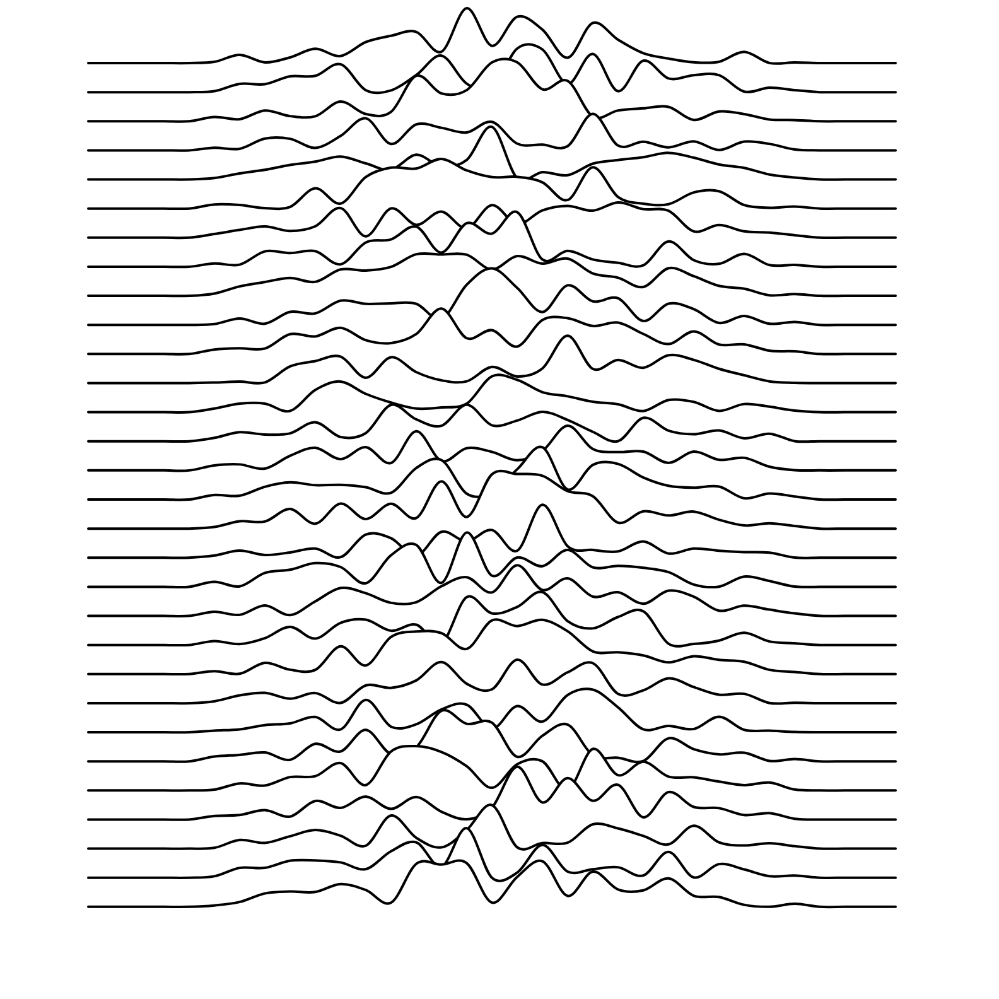

# generative_art

<table>
  <tr>
    <td>
      
1. tiled_lines

       
    </td>
    <td>
      
2. joy_division

       
    </td>
  </tr>
  <tr>
    <td>
      
3. circle_parking 

       
    </td>
    <td>
      
4. un_deux_trois

       
    </td>
  </tr>
  <tr>
    <td>
      
5. cubic_disarray

       
    </td>
    <td>
      
6. hypnotic_squares

       
    </td>
  </tr>
  <tr>
    <td>
      
7.hours_of_dark

       
    </td>
    <td>
      
8.piet_mondrian

       
    </td>
  </tr>
 </table>
