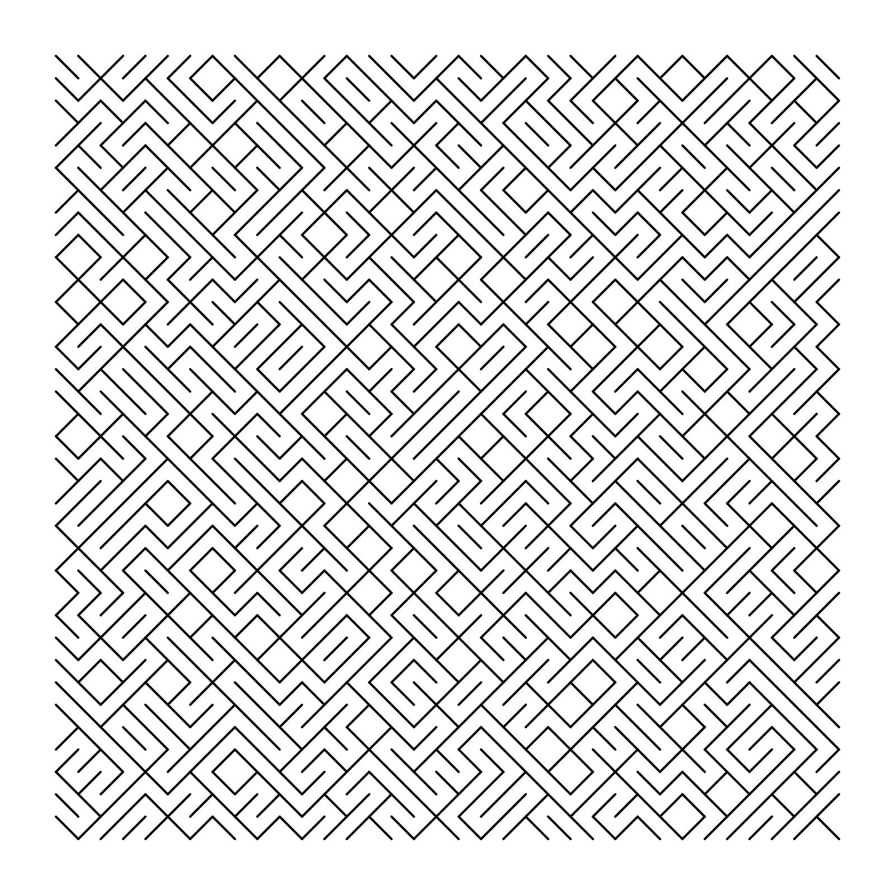
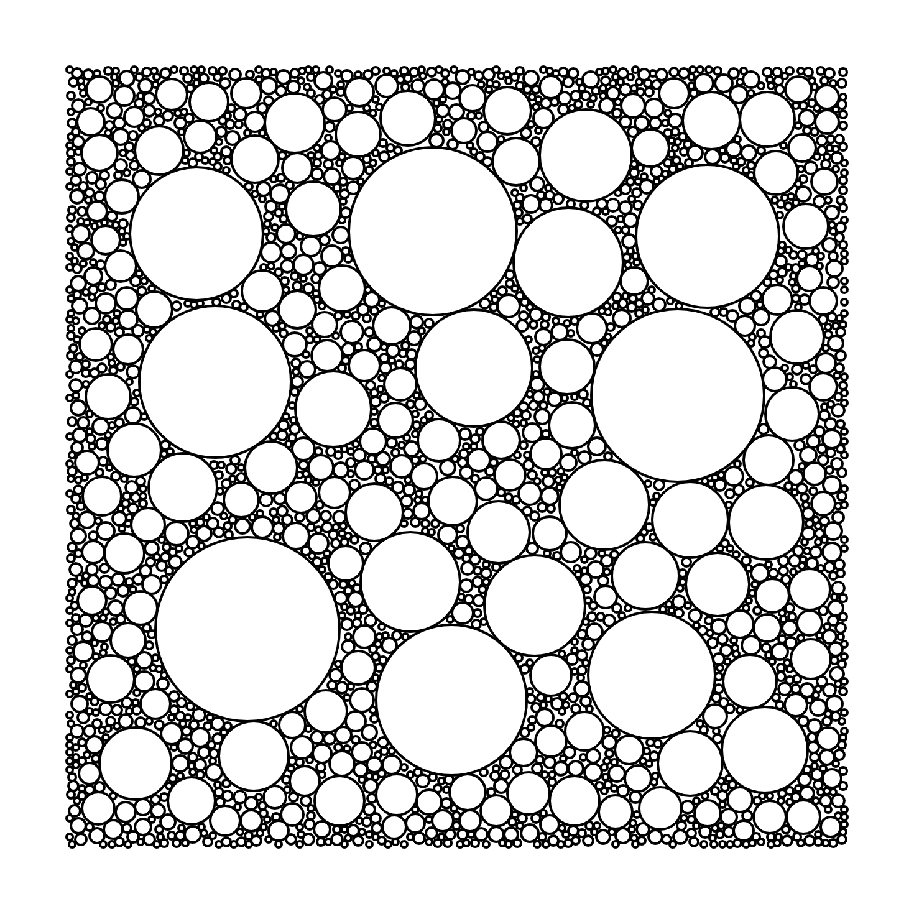

# generative_art

Recreate some art using algorithms

## Description

This is my fun project to create some art and use it for my wallpaper

## Usage

Run HTML file in each folder to get your picture. You can customize some variables in the script.js file to get different results

## Sample pics

<table>
  <tr>
    <td>
      
1. tiled_lines

       
    </td>
    <td>
      
2. joy_division

       
    </td>
  </tr>
  <tr>
    <td>
      
3. circle_parking 

       
    </td>
    <td>
      
4. un_deux_trois

       
    </td>
  </tr>
  <tr>
    <td>
      
5. cubic_disarray

       
    </td>
    <td>
      
6. hypnotic_squares

       
    </td>
  </tr>
  <tr>
    <td>
      
7.hours_of_dark

       
    </td>
    <td>
      
8.piet_mondrian

       
    </td>
  </tr>
 </table>
